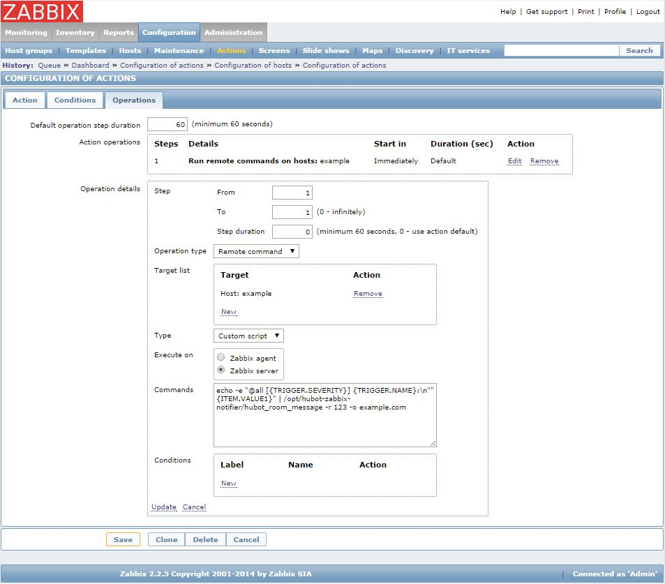

# hubot-zabbix-notifier

Notifies about Zabbix alerts

## Getting Started
1. Install the module: `npm install --save hubot-zabbix-notifier`
2. Add it `hubot-zabbix-notifier` to your external-scripts.json file in your hubot directory
3. Clone `hubot-zabbix-notifier` to zabbix server. ex: `/opt/hubot-zabbix-notifier`
4. Configure Zabbix Actions - Remote command `echo -e "@all [{TRIGGER.SEVERITY}] {TRIGGER.NAME}:\n""{ITEM.VALUE1}" | /opt/hubot-zabbix-notifier/hubot_room_message -r 123 -o example.com` (see Screenshot)

### Screenshot

## License
Licensed under the MIT license.

This script created with reference to the [halkeye/hubot-jenkins-notifier](https://github.com/halkeye/hubot-jenkins-notifier) and [hipchat/hipchat-cli](https://github.com/hipchat/hipchat-cli). And these are under the MIT license.

